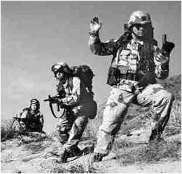
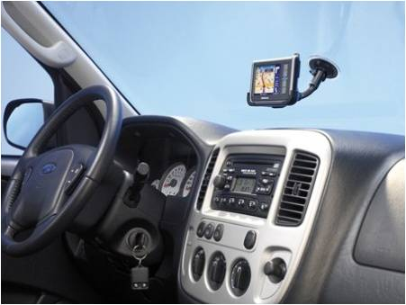
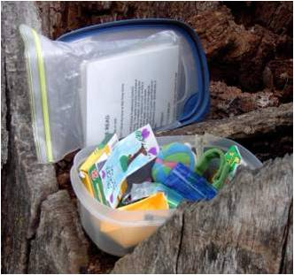
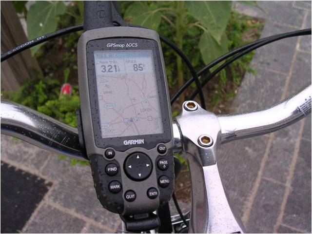

# Aplicaciones del GPS (12 de 31)

La necesidad de un posicionamiento exacto no está limitado a un único uso.  
Hoy día una **amplia variedad de sectores sociales necesitan o se benefician de un posicionamiento** **preciso**, como por ejemplo:

*   **Uso militar**: con él nació el sistema, y lógicamente se sigue utilizando
    
*   **Uso transporte:** para controlar flotas, viajes y todo lo relacionado con el transporte de pasajeros y mercancías
    
*   **Uso terapéutico y social:** geolocalización de personas con problemas o niños. Dsitancia entre dos personas
    
*   **Uso lúdico y ocio:** para geoposcionar el tiempo libre (recorridos senderistas, geolocalización de entradas de cuevas, etc..) y jugar con esa geoposición (geocaching)
    

