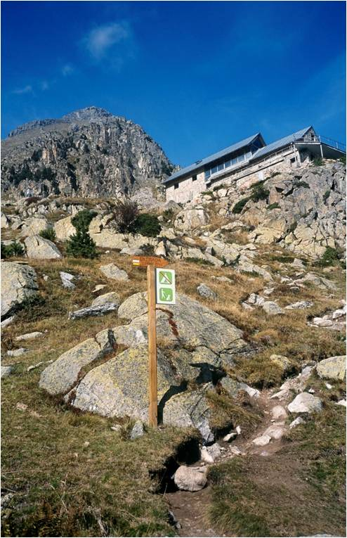

# Utilidades para el visitante: senderista o montañero (13 de 31)

El **practicante de actividades en el medio natural tiene en el GPS una herramienta de seguridad fundamental** para evitar todos los problemas que tienen que ver con saber dónde se está (**conocer la geoposición** de uno mismo o de elementos que buscamos en el terreno).

Sin embargo, conviene recordar e insistir que **el GPS nunca debería substituir al tradicional mapa+brújula**, sino complementarlo. Sólo en algunas ocasiones (noche cerrada, niebla densa, desorientación completa y falta de referencias a la vista) el GPS puede ayudarnos a solucionar un problema que incluso el más correcto uso del mapa dificilmente solucionaría, pero **el GPS es un aparato electrónico y como tal puede fallar** cuando menos nos lo esperamos.

Como **herramienta de seguridad** el GPS nos permite:

*   **Grabar tracks de recorridos** para guardarlos para futuras excursiones
    
*   **Descargar tracks de otras fuentes para cargar a nuestro GPS** y poder seguirlos sobre el terreno (p.e. rutas que no aparecen en los mapas, o itinerarios que no están señalizados sobre el terreno), también como acción "trackback".
    
*   **Hacer una acción "goto"** a un punto determinado para que el GPS nos lleve en linea recta (por ejemplo encontrar un abrigo en una zona boscosa y sin referencias)
    
*   **Poder proporcionar una coordendada de ubicación** en caso de tener que solicitar un rescate
    
*   **Poder localizarme sobre el mapa cuando me he desorientado**, pasando la coordenada del GPS al mapa (**atención a sistemas de coordenadas y datums**, eso lo veremos más adelante)
    

Como **herramienta lúdica** el GPS nos permite:

*   **Compartir nuestros tracks grabados** en redes sociales
    
*   **Extender el disfrute de la excursión** a la vuelta de la misma: "jugar" en el ordenador con el track grabado, verlo en 3D, preparar un mapa, etc...
    
*   Participar en **juegos de "búsqueda del tesoro"** ([**geocaching**](https://www.geocaching.com/play "Geocaching"))
    

#### Como federado, animate a usar el GPS por... (Varias opciones son posibles)