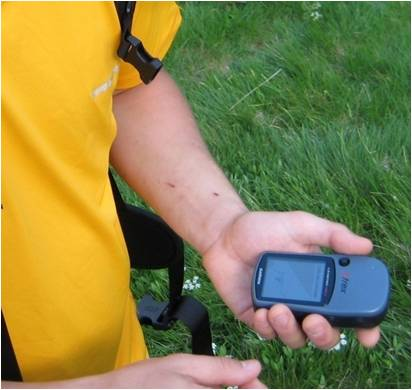

# Palabras Clave para entender al GPS (17 de 31)

Este **no es un curso de manejo de GPS**, puesto que en el mercado existen tantas marcas y modelos que sería imposible hacer un curso que sirviera para todos ellos, pero sí queremos proporcionar una **idea general del sistema y las posibilidades de su uso**.

En primer lugar nos haremos con las **palabras clave** de la información que es capaz de registrar un GPS:  

*   **Waypoint o punto de interés**: Posición de la Tierra en forma de **punto o par único de coordenadas**. Puede ir asociado a un icono gráfico, comentario, fecha y altura. Hace referencia a **una localízación única** (un refugio, un puente, un pico, un collado, un abrigo..) y **hay que marcarlo en el GPS de manera consciente**  
    
*   **Track o camino**: **Sucesión de puntos que conforman un camino**. En la mayoría de GPS el **track se graba automáticamente en cuanto el GPS se pone en marcha**, si bien se puede parar y también **configurar la precisión** con la que registra el track.  
    
*   **Ruta:** **Sucesión de Waypoints que conforman un itinerario**. Se configura a mano en el GPS (a partir de waypoints). Eso permite **navegar de un punto a otro en línea recta**, algo que en montaña no suele ser muy útil pero sí puedo serlo en grandes extensiones de territorio  
    
*   **Trackback:** **Posibilidad que tiene un GPS de guiar mediante brújula o mapa el seguimiento de un track** existente en el aparato, proporcionando instrucciones para mantenernos "encima" del camino y/o avisarnos cuando nos separamos de él. De gran utilidad en situaciones de niebla, noche o falta de visibilidad por cualquier otro motivo, pero siempre que se tenga el track guardado en el GPS
*   **GOTO: opción "ir a" un punto**, **permite lanzar una linea recta desde mi ubicación a otra ubicación puntual**, y el GPS nos irá guiando tanto a través de la pantalla de mapa como de la brújula  
    

#### Empareja las afirmaciones correctas...