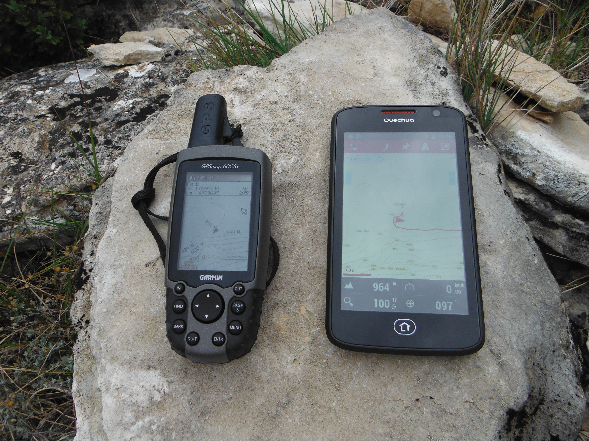

# Tipos de GPS (18 de 31)

Para un **uso en el medio natural** podemos pensar en **dos tipos de GPS**:

*   **El GPS senderista**: un aparato diseñado específicamente para ser usado en actividades al aire libre (con sus matices para senderismo, BTT, etc...)  
    
*   **El Smartphone o teléfono inteligente**, que lleva incorporado un sensor GPS que le permite geoposicionar el teléfono a través de la red de satélites GPS (ayudado en ocasiones por la geoposición de la red de antenas de telefonía móvil, pero de manera complementaria, no indispensable).  
    

**Descartamos los GPS de coche** ("navegadores") por ser poco prácticos en el medio natural (autonomía de batería bastante baja, pantallas muy grandes y de mala visibilidad en condiciones de luz abundante, base cartográfica diseñada para la navegación por carreteras y calles, no excursionista).  

**Hace diez años sólo se veían en el monte GPS de tipo senderista**, y tampoco muchos (en el año 2011, el 18,7% de los grupos encuestados llevaban un GPS de tipo senderista).  

**Ahora mismo** este porcentaje de usuarios de aparatos GPS senderistas no habrá variado mucho, pero lo que sí sabemos es que **prácticamente la totalidad de los practicantes de actividades en el medio natural llevan su teléfono móvil a la actividad**, y según [noticia publicada el 21 de enero de 2015](http://www.eleconomista.es/economia/noticias/6409674/01/15/Espana-lider-europeo-en-penetracion-de-smartphones-con-un-porcentaje-del-81-sobre-del-total-de-los-moviles.html#.Kku8tFAYwNSf6ZX "Porcentaje de Smartphones en España"), **el 81% de los móviles existentes en España eran Smartphones**, por lo podemos afirmar que cerca del 80% de los montañeros llevan GPS. Algunos lo saben y le sacan partido, otros no y están desaprovechando una herramienta de seguridad de gran valor.  

Esta realidad es un dato **positivo**. El precio de los GPS senderistas no han bajado sustancialmente en los últimos años (entre 150 y 600 €, según prestaciones), por lo que no es previsible que el número de usuarios de este tipo de aparatos vaya a aumentar de manera inmediata, mientras que **el Smartphone** **el usuario** se lo encuentra en el bolsillo y **está con él en la mano todo el día**.  

Ahora sólo nos queda sacarle partido...Pensando siempre en no dejar de lado todo ese potencial...  

#### Señala qué afirmación es la correcta:

####