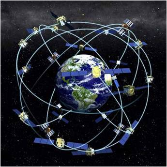

# Descripción del sitema: el segmento espacial (2 de 31)

El sistema **GPS** tiene **tres segmentos**:

*   **Segmento Espacial**
*   **Segmento de Control**
*   **Segmento de Usuario**  
    

El **Segmento Espacial** está formado por la **Constelación NAVSTAR** ( NAVigation Satellite Timing And Ranging:

*   **Entre 24 y 30 satélites**
*   6 órbitas planas, casi circulares e inclinadas
*   55º respecto al ecuador
*   A 20.200 Km de altura
*   Periodo de rotación de 12 horas
*   **Observación mínima de 4 a 6 satélite**s, 24 horas/día

Los **satélites** actúan como un **punto de referencia conocido**, transmitiendo información utilizando dos frecuencias de referencia L1=1575.42 MHz y L2=1227.60 MHz. Sobre estas frecuencias se modulan 2 códigos, llamados C/A y P. El código C/A, (Clear/Acces o Course/Acquisition), está disponible para todos los usuarios mientras que el código P (Precision-code), se reserva para usos militares.  
  

#### El segmento espacial lo componen...