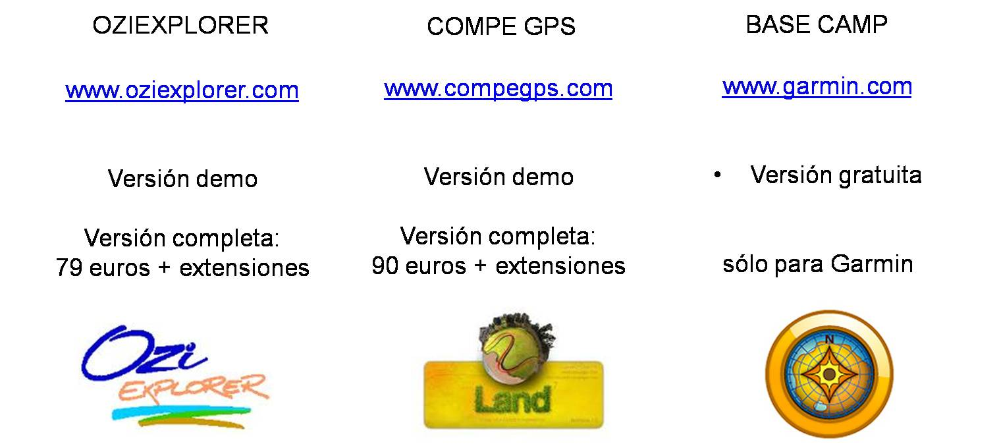

# GPS senderistas: mapas y programas (20 de 31)

Los **GPS senderistas** están preparados para **llevar una base cartográfica** en el mismo apartado. Con ello intentan asemejarse lo más posible al siempre imprescindible mapa tradicional, con el plus de que el GPS nos muestra dónde estamos sobre ese mapa.

Apenas se hacen GPS que no permitan llevar esa cartografía excursionista, y los pocos que quedan, aparte de ser más económicos, están diseñados fundamentalmente para actividades de [**geocaching**](https://www.geocaching.com/play "Web Geocaching").

**Si queremos comprar un GPS senderista** debemos saber que los precios varían, y bastante, en función de:  

*   **Si pueden incorporar tarjeta de memoria MicroSD o no**. En la tarjeta MicroSD, caso de tenerla, es donde se almacenan los mapas del GPS, por lo que si el GPS la tiene ello significa que podemos llevar en la mochila una base cartográfica prácticamente infinita, tantos mapas como quepan en la memoria MicroSD o incluso en varias memorias. Si no es así, la memoria interna del GPS limitará la cantidad de mapas que podamos llevar cargados  
    
*   **Si llevan cargados mapas excursionistas o de detalle excursionista** (1:25.000-1:50.000) por defecto o vienen sólo con un mapa general del mundo y nada más
    
*   También encarece el GPS el hecho de que este lleve **altímetro barométrico y brújula electrónica** (para obtener medidas de altitud y de orientación incluso sin señales GPS)
    
*   Actualmente, los GPS senderistas se van posicionando también por **su capacidad para conectar por vía Bluetooth** con nuestro teléfono móvil o con otros GPS y facilitar de este modo el intercambio de datos y la **conexión del GPS con las redes sociales e internet**  
    

Además, **si después queremos "jugar" en casa** con los datos que hemos recogido en el monte, **necesitaremos conectar el GPS con nuestro ordenador**.  

Para ello dos son los programas que más se utilizan (ambos de pago y con versiones demo), aunque cada marca tiene también su programa gratuito de descarga del GPS y otras funcionalidades, normalmente más limitadas que las de los programas de pago.  

