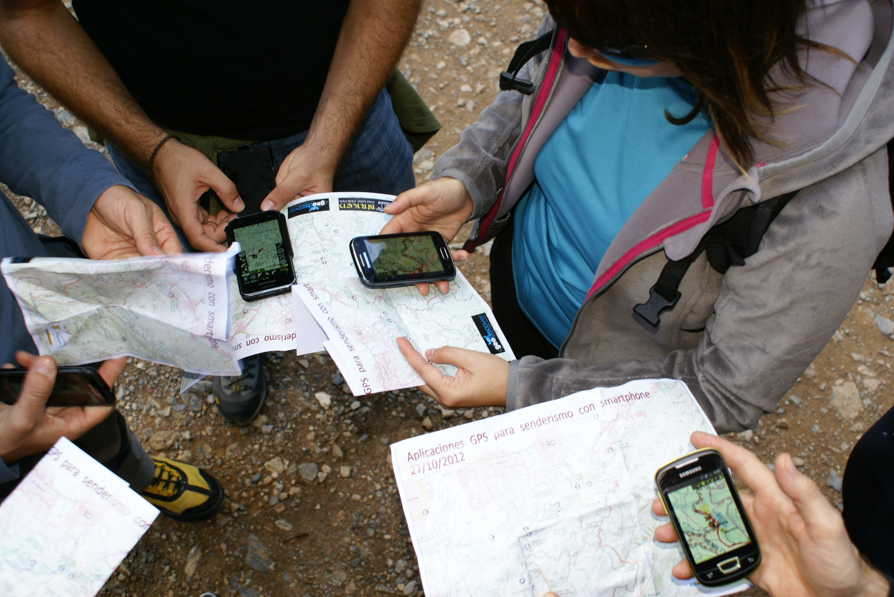

# El GPS del Smartphone (21 de 31)  

Tal como hemos ido insistiendo hasta aquí, **muchas personas desconocen que llevan GPS en su teléfono Smartphone**, o lo saben pero no saben lo útil que les puede resultar en montaña o en sus actividades en el medio natural.

Por un motivo u otro, todavía un grupo importante de excursionistas y montañeros dicen no tener GPS sin ser cierto, lo que también significa que en realidad lo llevan pero como **no saben usarlo** es como si no lo llevaran.  

En la próxima página veremos cómo hacer trabajar nuestro Smartphone como un GPS senderista y nos acercaremos a las bondades de este sistema. Pero aquí, primero, vamos a sacarle los colores.  

Nuestro **Smartphone tiene ciertas limitaciones y/o condicionantes** que no se dan (o se dan menos) en un GPS senderista. Conviene conocerlas:  

*   **La pantalla grande y las roturas:** más expuesto a romperse por golpes, aunque esto se soluciona con una buena funda protectora  
    
*   **La pantalla y la visibilidad:** algunos teléfonos suelen tener pantallas con muchos reflejos, que se ven muy mal a pleno sol. Para solucionarlo se recurre a la retro iluminación de la pantalla, lo que da problemas del tipo siguiente:  
    
*   **La autonomía:** al tener una pantalla grande, y opciones frecuentes de retro iluminación, la batería suele durar menos que las pilas de un GPS senderista, aunque esto se soluciona llevando cargadores adicionales  
    
*   **La precisión del GPS**: **esto es más bien un mito** que algo que nos pueda suponer un problema serio en la montaña. En condiciones óptimas (de buena recepción de satélites correctamente distribuidos en la esfera del cielo que tenemos visible, y con las baterías en buena carga) **la precisión de un GPS Smartphone puede ser ligeramente inferior a la de un GPS senderista**, pero normalmente esto es porque el segundo recibe (y puede corregir parte de la señal con ello) los satélites de corrección diferencial SBAS (WAAS-EGNOS), mientras que el teléfono no. **En cualquier caso estamos hablando de unos pocos metros, normalmente no de decenas de metros,** por lo que a efectos de seguridad no es un motivo por el que no usar el GPS del Smartphone en montaña.  
    

#### Sobre el uso del GPS del Smartphone podemos afirmar que...