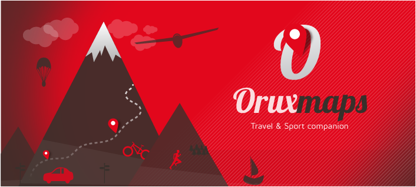

# Hacer trabajar nuestro Smartphone como un GPS senderista (22 de 31)

Si queremos **hacer trabajar nuestro Smartphone como un GPS senderista necesitaremos instalar alguna App** en el teléfono que le permita al GPS extender sus funcionalidades.

Existen varias App's que lo permiten, y cada día salen unas nuevas, se desactualizan otras, y nuestra recomendación en ese sentido no serviría de nada pues este mundo se mueve muy deprisa.  

De todas maneras, que sepas que **si eres usuario de iPhone la App que está mejor valorada por los usuarios es [Maps 3D](https://itunes.apple.com/es/app/maps-3d-lite-rutas-con-gps/id426034047?mt=8 "Maps 3D para iPhone")****,** mientras que **si eres usuario de Android hasta el momento** [**OruxMaps**](http://www.oruxmaps.com/ "Orux Maps") **es quien se lleva las mejores valoraciones**. Ambas son gratuitas o tienen una versión gratuita.  

**OruxMaps es una App pero también tiene una versión de escritorio para instalar en tu PC** y poder trabajar y traspasar información del ordenador al teléfono-GPS y a la inversa. Esta versión de escritorio **permite "fabricar" mapas en formato imagen y cargarlos al teléfono y poder trabajar con ellos en modo "offline"** (sin conexión a internet del teléfono). Además:  

*   Es la **aplicación gratuita que ofrece mayores capacidade**s para el manejo de GPS/GNSS con el dispositivo móvil
    
*   **Permite la visualización de mapas online** (con conexión del teléfono a internet) **y offline** (cargados en la memoria del propio teléfono, para que estén disponibles cuando no se tiene conexión a internet) **construidos a partir de diversas fuentes**
    
*   **Permite grabar los recorridos** que realizamos (track) **y los puntos de interés** (waypoints) o seguir uno diseñado desde casa previamente
    
*   **Muestra coordenadas**, rumbo, velocidad, altitud, distancia..
    
*   **Recibe avisos por voz**, al alejarse de la ruta, al acercarte a los sitios de interés, cada XX kms., etc.
    
*   **Comparte tu posición** con otras personas que utilicen OruxMaps
    
