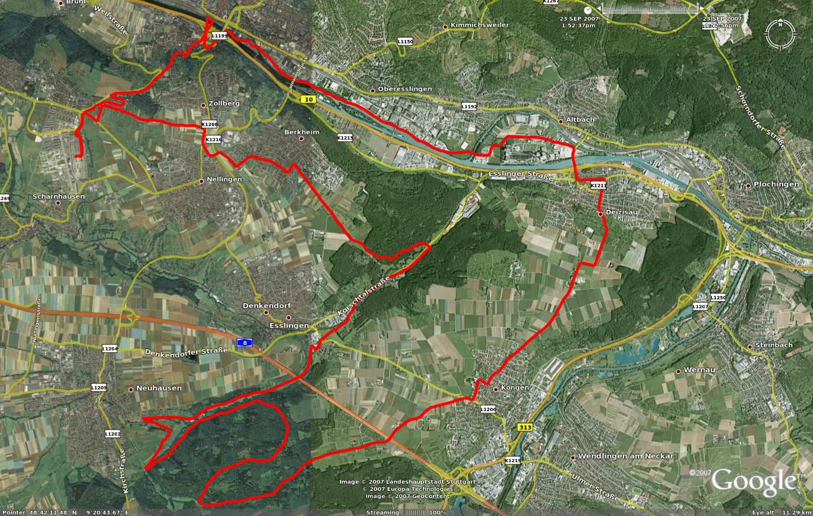

# Caminando con el GPS para registrar un track (23 de 31)

**¿Nos ponemos a caminar?** Sí, haber llegado hasta la diapositiva 23 sin haber salido a hacer ningún recorrido te puede parecer una pérdida de tiempo, pero ya os adelantamos al inicio que **este no es un curso de manejo de GPS, sino de fundamentos del GPS**: comprender para saber utilizar...

Bien, pues cogemos nuestra mochila y nos ponemos a andar, sí. Hemos sido unos montañeros prudentes y **llevamos de todo: mapa, brújula y sí, también GPS**.

**Si se trata de un GPS senderista sólo con ponerlo en marcha**, si no lo hemos configurado de otra manera, **el GPS lo primero que hace es buscar su posición en el mundo ("geolocalizarse") y una vez conseguido eso empieza a guardar posiciones de dónde estamos**. Si nos movemos, por supuesto, va guardando posiciones de nuestro movimiento. Es lo que denominamos **"track" o "traza"** (puedes repasar las "palabras clave si ya no te acuerdas).  

**Si se trata de un Smartphone**, con un programa para hacer trabajar el teléfono como un GPS senderista, **lo normal es que debamos activar la grabación del track**. Cada programa tiene su manual de instrucciones, invierte un tiempo en aprender en él lo más fundamental.  

Normalmente **la precisión del track se puede configurar** en ambos casos: podemos pedirle al GPS que haga esa grabación cada X metros que nos movemos, cada X minutos que pasan o cuando él considere necesario. Mayor precisión implica que nuestro track tendrá un mayor número de puntos, y por lo tanto al final será un archivo más pesado, pero tampoco debe preocuparnos mucho esto, pues estamos hablando de que una excursión de unas 8 horas grabada con detalle puede pesar unos 200 kb, tampoco es mucho...  

En cualquier caso, no debemos olvidar que el GPS grabará todo lo que hagamos: si nos salimos del camino, si vamos a por setas, si nos perdemos...a no ser que lo paremos de manera explícita (que también se puede).  

Además, **el track que vamos grabando siempre se verá sobre el mapa** que llevemos cargado de fondo como una linea que dibujan nuestros pies. **Es una manera de "dejar miguitas de pan"** para encontrar el camino de regreso, pero en este caso se trata de miguitas virtuales.  

El **archivo de descarga del track acostumbra a ser un formato [GPX](https://es.wikipedia.org/wiki/GPX "Formato GPX en wikipedia")** (**GPS eXchange Format**), formato universal de intercambio de información geográfica. Es un formato que podemos abrirlo con un editor de textos normal, y veremos que es de una gran sencillez: una sucesión de coordenadas geográficas ([**Datum**](https://es.wikipedia.org/wiki/Datum "Datum en wikipedia") WGS84, si no recuerdas lo que es eso puedes repasarlo en el curso de cartografía, aunque también podrás vivir sin saberlo...) que son los puntos que componen nuestro camino, con todas sus revueltas.  

#### En resumen, un track es...