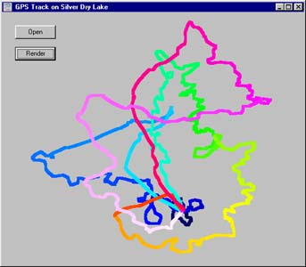

# Caminando con el GPS para seguir un track que nos hemos descargado (24 de 31)

De la misma manera que cuando vamos grabando un track lo podemos ver en la pantalla de nuestro GPS, **también podemos llevar uno o varios tracks cargados en el GPS e intentar seguirlos**.

**La forma más sencilla de seguirlos en el campo es, sencillamente, verlos sobre la pantalla del mapa** y seguirlo (**¡siempre a un nivel de zoom adecuado -suficientemente "cercano"-, no olvidéis nunca eso pues es una causa de muchos de los errores con el GPS!)**.  

Pero el GPS también permite esa **opción de "trackbak"** que antes nombrábamos, que consiste en **decirle al GPS que me lleve por un camino determinado**. Bajo esa orden, **el GPS se pone a trabajar y está comparando constantemente nuestra posición con la que deberíamos llevar,** bien sea desde el mapa o desde la pantalla de la brújula (en el caso de los GPS senderistas), nos indica hacia donde deberíamos estar caminando o moviéndonos.  

**El trackbak es de cierta utilidad porque además el GPS calcula el tiempo que nos queda hasta destino y a qué hora vamos a llegar**, pero si eres capaz de sacar estas conclusiones por ti mismo lo normal es que los tracks que se llevan en el GPS sirvan para comprobar si vamos bien o no, sin necesidad de que el GPS nos vaya llevando de la mano.  

Ahora bien, **es un juego muy interesante** y una de las posibilidades de los GPS. Prueba alguna vez que tengas tiempo a hacer un trackback. Eso sí, aunque vayas andando y mirando la pantalla del GPS...¡mírate también los pies!  

