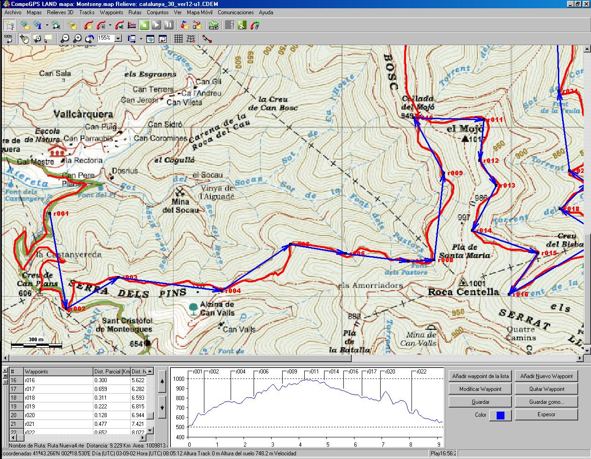
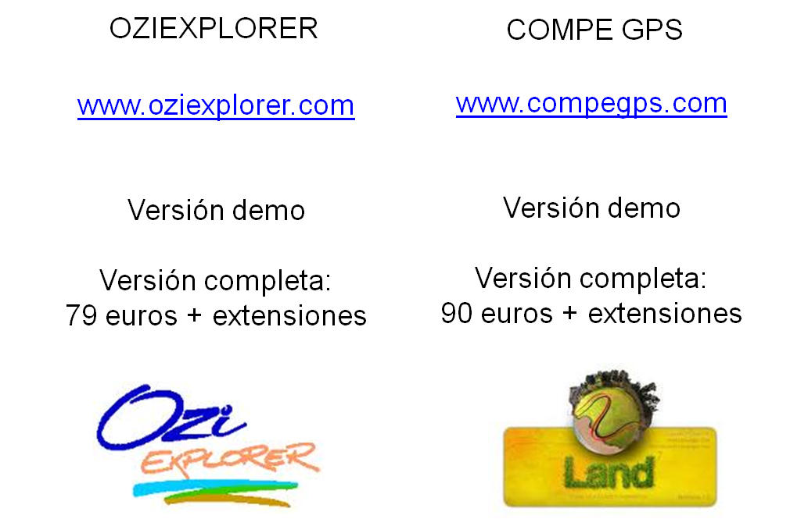

# ¿Y después de la excursión?: programas  y mapas para trabajar en casa (28 de 31)

Como ya hemos comentado antes, el **GPS puede ser también una manera de "extender" en el tiempo nuestra excursión**. La **planificación previa** de la misma se puede ver enriquecida si sumamos a todos los protocolos y elementos de seguridad el buscar el track de una ruta y cargarla al GPS.

**Después de la excursión**, lo habitual es **descargar el track y los waypoints** a nuestro ordenador, aunque sólo sea para almacenar esta información y poder volver a ella si un día repetimos la excursión o queremos compartir esta información con otras personas.  

Sea como sea, **si queremos comunicar nuestro GPS con nuestro ordenador** y manejar la información del GPS en el ordenador, **deberemos disponer de algún programa específico para ese fin**.  

Las marcas de GPS senderista tienen sus propios programas gratuitos para ello. La información grabada en nuestro Smartphone lo normal es que la podemos descargar a través del teléfono, conectando el mismo como una unidad de almacenamiento más.  

Pero existen en el mercado por lo menos dos programas específicos que nos permitirán muchas opciones, se trata de [**OziExplorer**](http://www.oziexplorer.com/ "OziExplorer") y [**CompeGPS**](http://www.twonav.com/es/ "CompeGPS")  

Ambos ofrecen **un gran número de utilidades, entre ellas las de fabricarte tu propio mapa para llevar al monte a partir de un track y una base cartográfica**, pero también permiten **obtener datos de distancia y desniveles** del track, hacer recreaciones virtuales de **vuelo 3D** sobre el mismo, etc...

Ambas marcas ponen a la **venta también cartografía en imagen para poder utilizar como base en el programa** (no en el GPS, sino en el ordenador) mucha de ella con detalle e información excursionista. Aunque **también el Instituto Geográfico Nacional tiene a libre descarga varias bases cartográficas** de toda España y, en última instancia, **si no encontramos un mapa digital, siempre podremos "georreferenciar" una fotografía que le hagamos a nuestro mapa en papel...**  

Estos programas también permiten **obtener perfiles**, por lo que la composición de mapa+perfil+datos técnicos es una información fácil de elaborar y puede ser un importante soporte a la seguridad de las actividades.  

