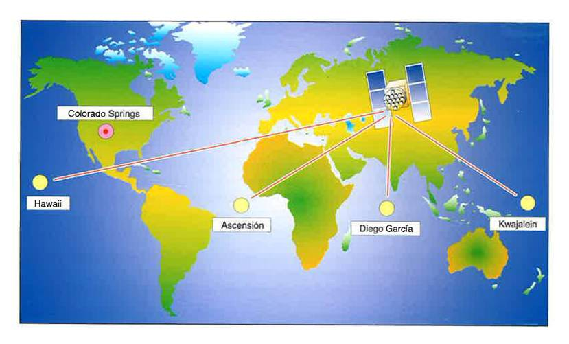

# Descripción del sistema: el segmento de control (3 de 31)

El **segmento de control** es quien gobierna el sistema, a través de **5 estaciones de gran precisión situadas en Tierra**. Estas estaciones son **Hawai, Colorado Springs, Isla de Ascensión en el Atlántico Sur, Diego García en el Índico y Kwajalein en el Pacífico Norte**. Estas estaciones realizan un seguimiento continuo de los satélites y **pueden realizar cambios en la información transmitida por los satélites**.  

La **estación maestra envía las correcciones de reloj a cada satélite**. Cada satélite envía posteriormente subconjuntos de estas informaciones a los receptores de GPS mediante señales de radio.
