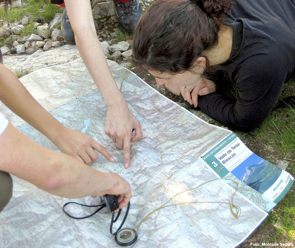

# ¡Felicidades: estás a punto de terminar el curso! (31 de 31)

  
Te damos la enhorabuena por ello y te agradecemos el esfuerzo y el tiempo que le has dedicado.

Esperamos que te haya sido provechoso y te animamos a que nos comentes tus impresiones o nos aportes comentarios para que podamos mejorar. **¡No olvides darle a "fin de la lección" para que el curso se considere finalizado!**  

Recuerda que entre todos podemos educar en el **correcto y habitual uso del GPS en montaña**, y que vuestro papel de **montañero** es fundamental para ello.

**¡No olvides darle al botón de "fin de la lección" para que el curso se considere finalizado!**

#### ¡Muchas gracias y hasta pronto!

#### Montaña Segura