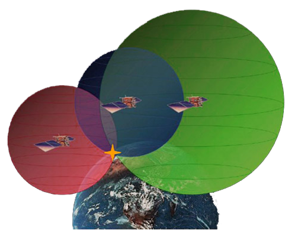

# Cómo funciona el GPS (5 de 31)

El sistema GPS **funciona** de la siguiente manera:

1.  Las **señales de los satélites** **son leídas desde las estaciones**: Isla Ascensión, Isla Diego García, Hawái y Kwajalein
2.  **Estas mediciones son enviadas a la Estación de Control Maestro en Colorado Springs**, donde son procesadas para **determinar cualquier error**
3.  **La información es enviada a las cuatro estaciones de observación equipadas con antenas de tierra y de allí cargada a los satélites**
4.  **El GPS recibe la señal de varios satélites y calcula la distancia que lo separa de éstos mediante su software interno**
5.  A partir de estas distancias se crean **esferas imaginarias con centro en el satélite**. **La intersección de al menos 3 esferas da la posición exacta del receptor**

#### Entonces, ¿qué elementos son necesarios en el sistema GPS para tener una medida de mi posición sobre la tierra?...