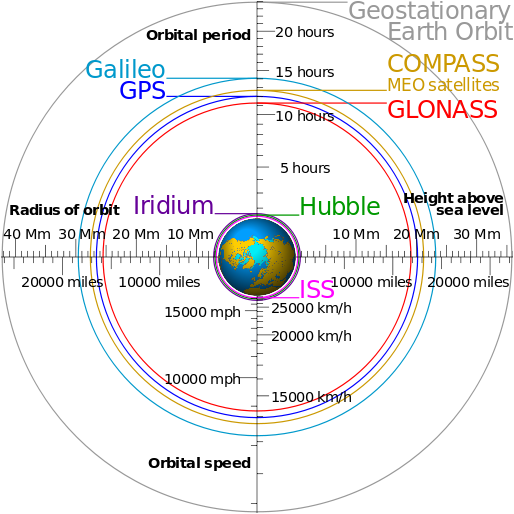

# Otros sistemas GNSS: GLONASS (8 de 31)

El [**s**](https://es.wikipedia.org/wiki/GLONASS "GLONASS en wikipedia")[**istema GLONASS**](https://es.wikipedia.org/wiki/GLONASS "GLONASS en wikipedia") es otro sistema que **creó la Unión Soviética** de manera homóloga al sistema GPS de los americanos. Consta de una constelación de **31 satélites** (24 en activo, 3 satélites de repuesto, 2 en mantenimiento, uno en servicio y otro en pruebas).  

Los **tres primeros satélites** fueron colocados en órbita en octubre de **1982**. El sistema fue pensado para ser funcional en el año 1991, pero la constelación no fue terminada hasta diciembre de 1995 y **comenzó a ser operativo el 18 de enero de 1996**.

**A finales de 2007 son 19 los satélites operativos**. Son necesarios 18 satélites para dar servicio a todo el territorio ruso y 24 para poder estar disponible el sistema en todo el mundo.

En **2007, Rusia anuncia que a partir de ese año se eliminan todas las restricciones de precisión en el uso de GLONASS**, **permitiendo así un uso comercial ilimitado**. Hasta ese momento las restricciones de precisión para usos civiles eran de 30 metros.
